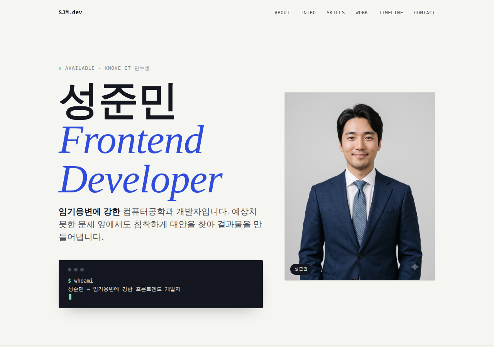
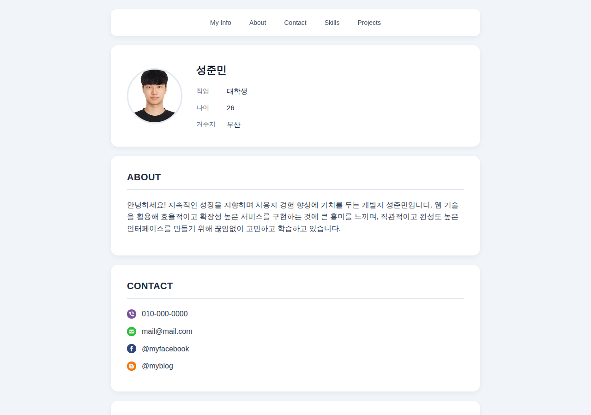
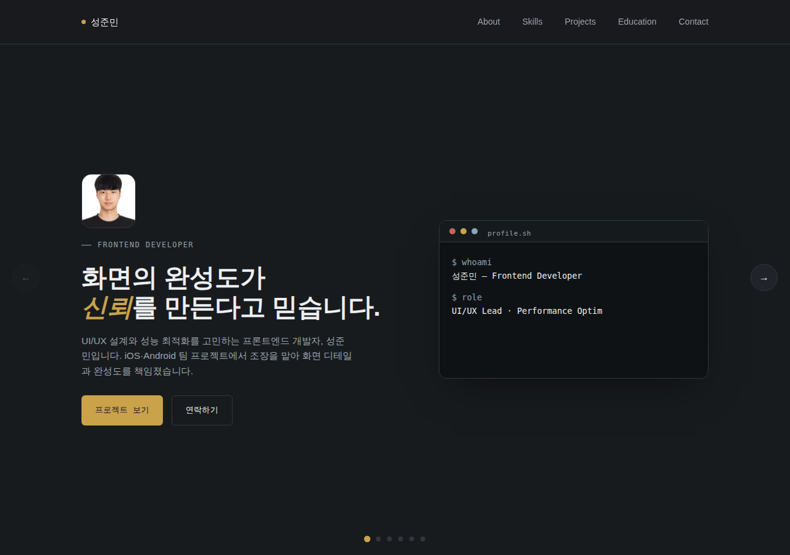
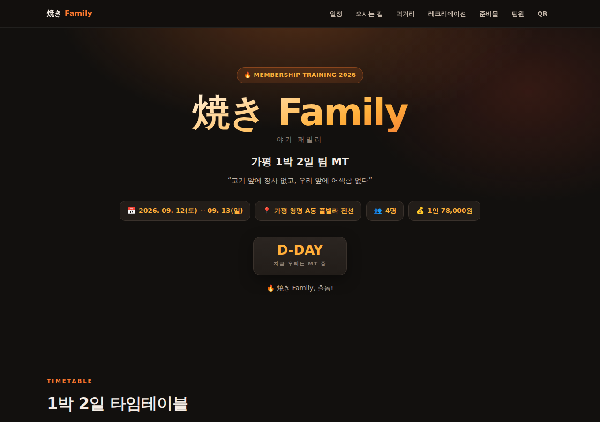
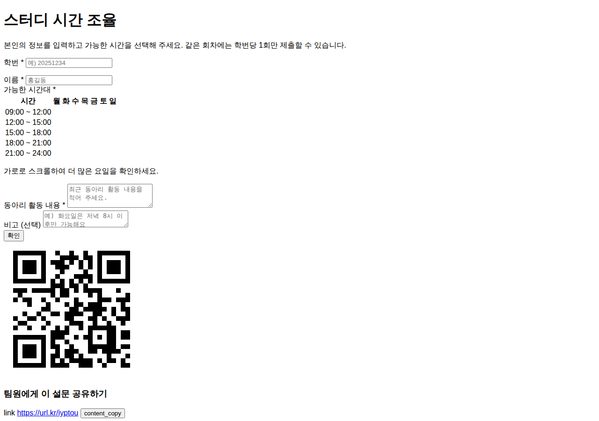
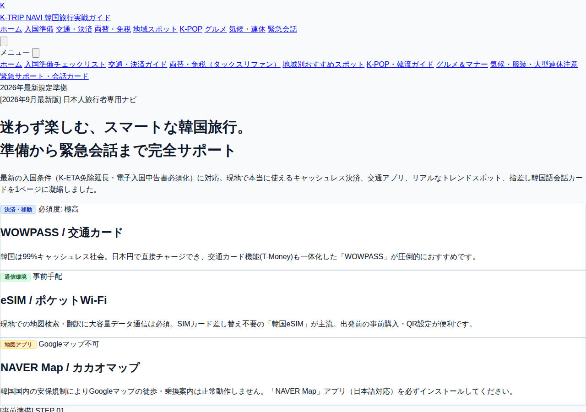

# HCJ

성준민이 만든 개인 프로젝트 모음 저장소예요. 날짜별 실습 폴더와 "바이브 코딩" 강의 포트폴리오로 구성돼 있어요. 각 폴더의 `index.html`을 더블클릭하면 바로 실행할 수 있어요.

## 📂 프로젝트 목록

| 폴더 | 프로젝트 | 설명 |
|---|---|---|
| [`0723`](0723/readme.md) | 성준민 — Frontend Developer | 개인 소개 페이지 |
| [`0724`](0724/readme.md) | 성준민의 이력서 | 온라인 이력서 페이지 |
| [`0727`](0727/readme.md) | 성준민 — Frontend Developer (개선판) | 0723을 다듬은 소개 페이지 |
| [`0831`](0831/readme.md) | 焼き Family MT | 가평 1박 2일 팀 MT 안내 페이지 (Google Apps Script 연동) |
| [`0901`](0901/readme.md) | 스터디 시간 조율 | 팀원 가능 시간 취합용 Google Apps Script 웹앱 |
| [`0907`](0907/README.md) | K-TRIP NAVI | 일본인 관광객 대상 한국 여행 가이드 사이트 |
| [`vibe_coding`](vibe_coding/README.md) | 바이브 코딩 포트폴리오 | 16개 실습 웹앱 모음 (청첩장, QR, GIF 편집, BMI 계산기 등) |

## 🖼️ 실행 화면 미리보기

| 0723 | 0724 | 0727 |
|---|---|---|
|  |  |  |

| 0831 | 0901 | 0907 |
|---|---|---|
|  |  |  |

`vibe_coding`의 16개 프로젝트 실행 화면은 [`vibe_coding/README.md`](vibe_coding/README.md)의 갤러리에서 볼 수 있어요.

## 💬 소감

날짜별 폴더 하나하나가 그 날 새로 배우거나 다듬은 결과물이에요. 개인 소개 페이지부터 Google Apps Script 웹앱, 접근성까지 신경 쓴 반응형 가이드 사이트, 그리고 순수 HTML·CSS·JS로 만든 16개의 실습 앱까지 — **내가 직접 해봤으니 다음에 비슷한 아이디어가 떠올랐을 때도 충분히 만들 수 있어요.**
