# 🚀 바이브 코딩(Vibe Coding) 포트폴리오

이 폴더는 "바이브 코딩" 강의를 들으며 직접 아이디어를 정하고, 요구사항을 말로 설명해서 하나씩 완성해 온 웹 앱들을 모아둔 곳이에요. 총 **16개**의 프로젝트를 HTML, CSS, JavaScript만으로 만들었고, 각 폴더를 열어서 `index.html`을 더블클릭하면 바로 실행돼요.

## 📂 프로젝트 목록 & 실행 결과

| # | 프로젝트 | 폴더 | 한 줄 소개 |
|---|---|---|---|
| 예제 4 | 💌 모바일 청첩장 | `chapter3/wedding_invitation` | 사진·일정·카운트다운을 담은 감성 모바일 청첩장 |
| 예제 5 | 📱 Smart QR | `chapter3/qr` | URL을 입력하면 QR 코드를 생성하고 JPG로 저장 |
| 예제 6 | 📦 Smart Doc Compressor | `chapter3/Compressed_file` | PDF·문서·이미지 파일 용량을 자동으로 압축 |
| 예제 7 | 🖼️ Smart Image Resizer | `chapter3/image` | 사진을 원하는 비율로 일괄 리사이즈하고 ZIP으로 다운로드 |
| 예제 8 | 🎬 Video to GIF | `chapter3/gif` | 동영상을 업로드하면 자동으로 GIF 애니메이션으로 변환 |
| 예제 9 | 🎞️ GIF 편집 스튜디오 | `chapter3/gif_edit` | 리사이즈, 자르기, 회전, 배속, 압축 등 GIF 올인원 편집기 |
| 예제 23 | 🔮 나나도사 오늘의 운세 | `chapter6/nana_dosa` | 이름·생일·성별·원소를 고르면 오늘의 운세를 알려주는 앱 |
| 예제 24 | ✍️ 글자 수 세기 | `chapter6/nana_web` | 한글 2byte 규칙까지 반영한 글자/단어/바이트 카운터 |
| 예제 25 | 📄 문서 파일 통계 분석기 | `chapter6/documents` | PDF·DOCX의 글자 수, 단어 수, 이미지 개수 분석기 |
| 예제 26 | 📝 Lorem Ipsum 생성기 | `chapter6/Lorem_lpsum` | 슬라이더로 원하는 글자 수만큼 더미 텍스트 생성 |
| 예제 27 | 📎 PDF 합치기 | `chapter6/pdf_merge` | 여러 PDF를 원하는 순서로 정렬해서 하나로 병합 |
| 예제 28 | 🔔 부재 중 알리미 | `chapter6/away_notice` | 일정·복귀 시간·안내 문구와 실시간 카운트다운 표시 |
| 예제 29 | ⚖️ BMI 계산기 | `chapter6/bmi_calculator` | BMI와 표준체중 90/100/110% 목표 체중 안내 |
| 예제 30 | 💥 대포 추첨기 | `chapter6/cannon_lottery` | 물리 시뮬레이션으로 구슬을 발사해 당첨자를 뽑는 추첨기 |
| 예제 31 | 📌 족집게 요약 앱 | `chapter6/doc_summarizer` | TextRank 알고리즘으로 문서 핵심 문장만 요약 |
| 예제 32 | 🎧 오디오 편집기 | `chapter6/audio_editor` | 오디오 포맷 변환, 볼륨 조절, 구간 자르기 |

## 🖼️ 실행 결과 갤러리

**예제 4. 모바일 청첩장**

**예제 5. Smart QR**

**예제 6. Smart Doc Compressor**
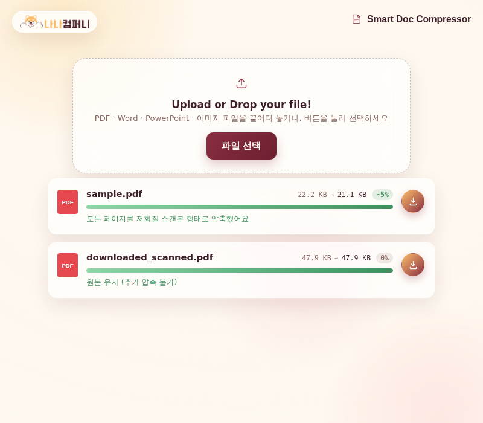

**예제 7. Smart Image Resizer**
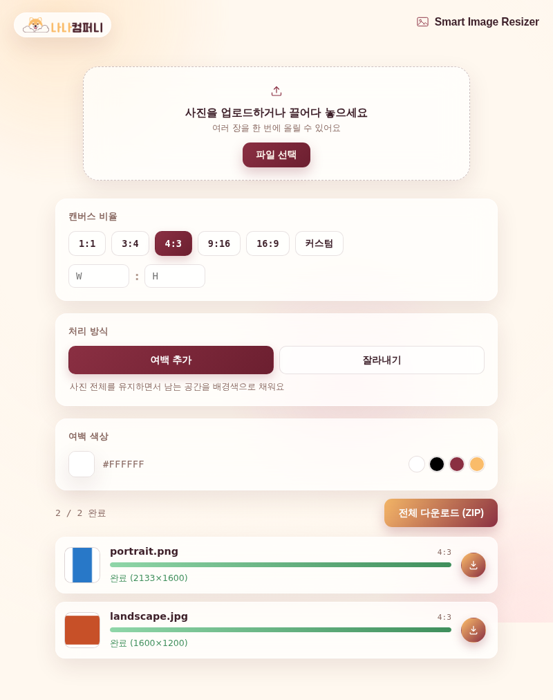

**예제 8. Video to GIF**
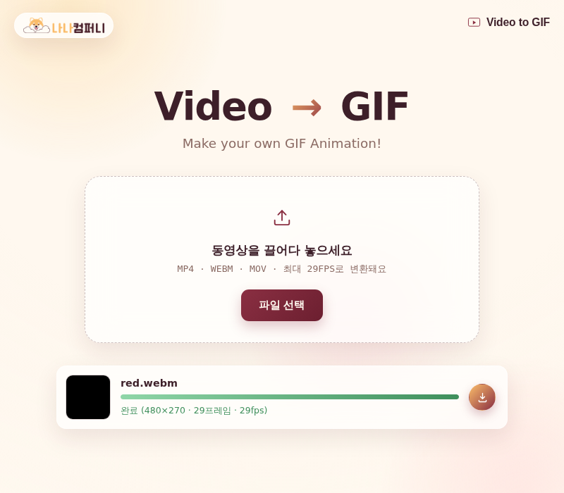

**예제 9. GIF 편집 스튜디오**
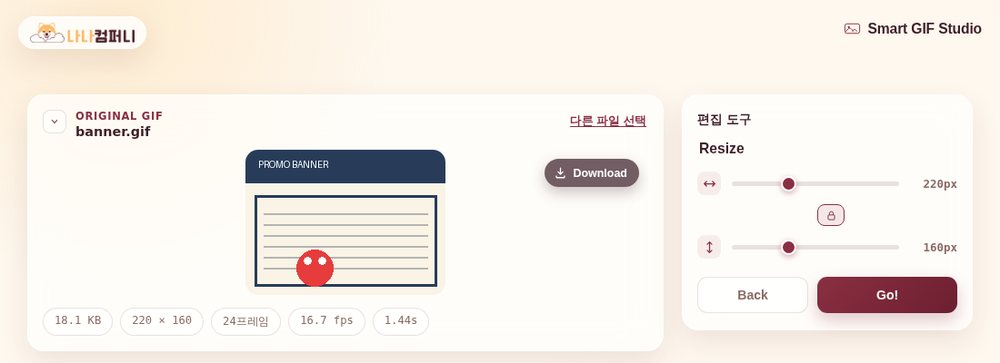

**예제 23. 나나도사 오늘의 운세**
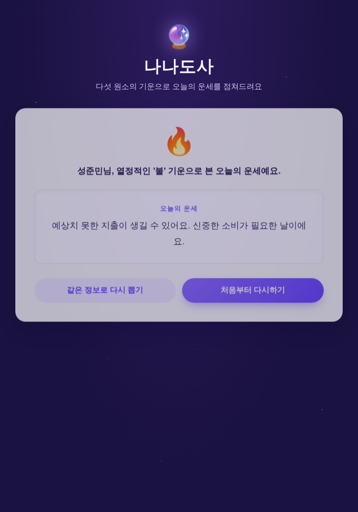

**예제 24. 글자 수 세기**
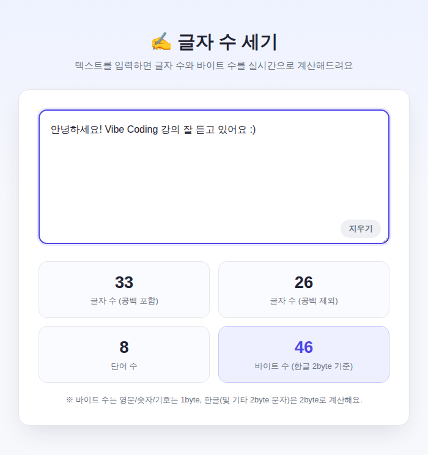

**예제 25. 문서 파일 통계 분석기**
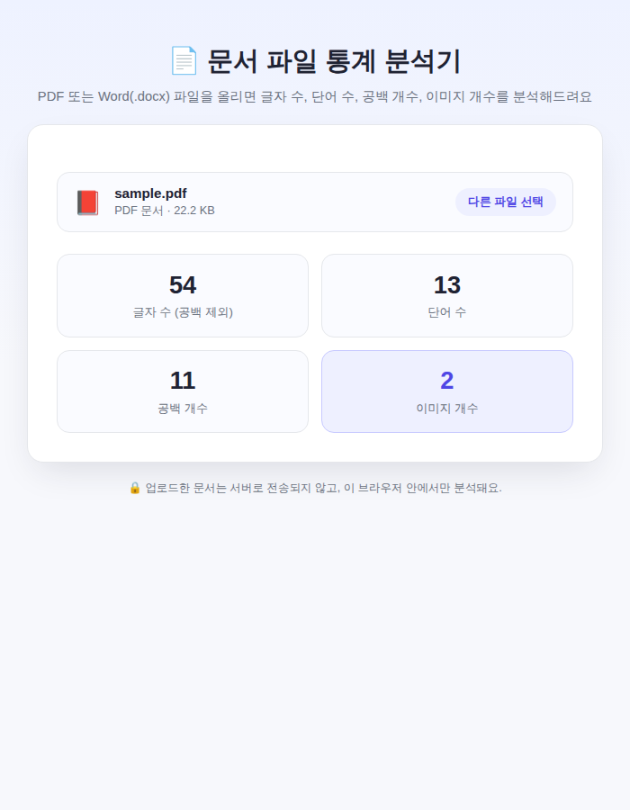

**예제 26. Lorem Ipsum 생성기**
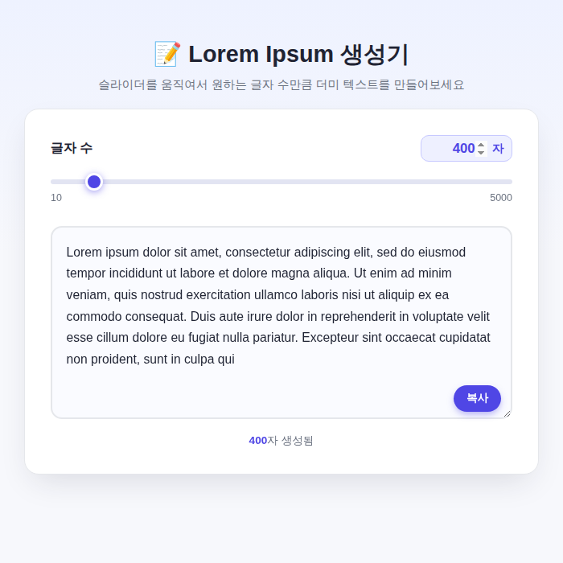

**예제 27. PDF 합치기**
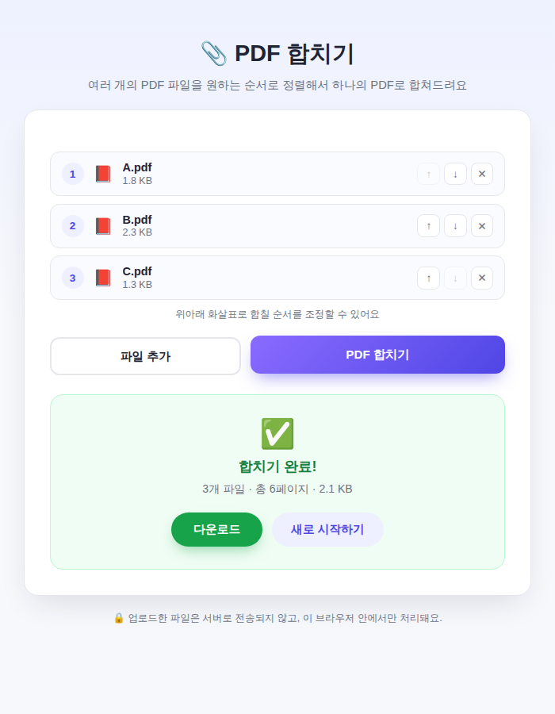

**예제 28. 부재 중 알리미**

**예제 29. BMI 계산기**
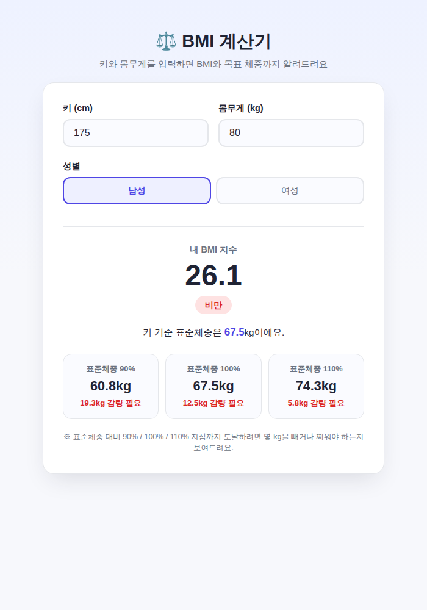

**예제 30. 대포 추첨기**
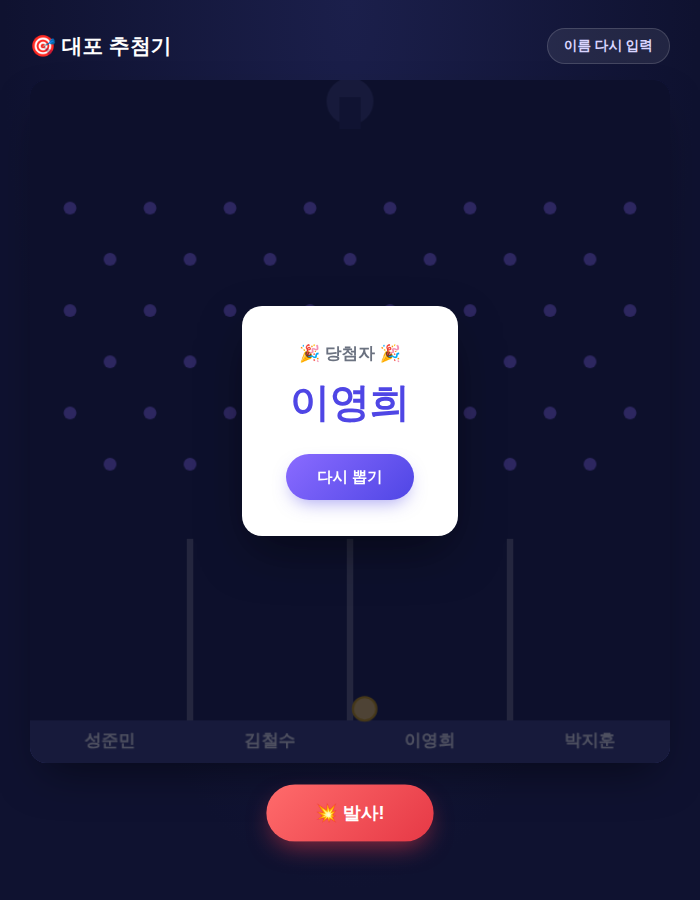

**예제 31. 족집게 요약 앱**
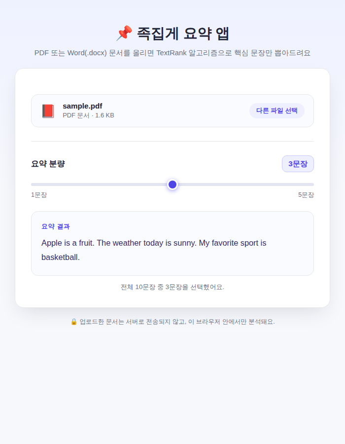

**예제 32. 오디오 편집기**
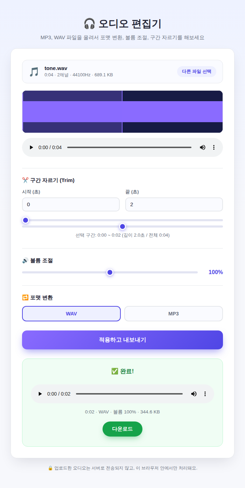

각 프로젝트 폴더 안에도 그 프로젝트만의 `README.md`가 따로 있으니, 자세한 기능 설명이 궁금하면 해당 폴더를 확인해 보세요.

## 💬 소감

16개의 프로젝트를 하나씩 완성하면서, 모바일 청첩장 같은 감성적인 UI부터 QR 코드 생성, 문서·이미지·동영상 파일 처리, 물리 시뮬레이션(대포 추첨기), PDF·DOCX 텍스트 추출(문서 통계 분석기, 요약 앱), TextRank 요약 알고리즘, Web Audio API를 이용한 오디오 편집, GIF 프레임 단위 편집까지 — 처음엔 막막해 보였던 기능들을 결국 직접 만들어냈어요.

프레임워크나 외부 서비스 없이 순수 HTML·CSS·JavaScript만으로, 그것도 인터넷 서버 없이 파일을 그냥 더블클릭해서 열어도(`file://` 프로토콜) 정상 동작하도록 만든다는 제약도 있었지만, 하나하나 원인을 찾아 해결하며 여기까지 왔어요.

**내가 직접 해봤으니, 다음에 비슷한 아이디어가 떠올랐을 때도 충분히 만들 수 있어요.** 처음 보는 라이브러리, 처음 다뤄보는 파일 포맷, 처음 구현해보는 알고리즘이라도 하나씩 뜯어보고 테스트하면서 완성해 나가면 된다는 걸 이 16개의 프로젝트가 증명해줬어요. 앞으로 더 복잡한 아이디어가 생기더라도, 이번에 쌓은 경험을 발판 삼아 또 하나씩 만들어볼 수 있을 거예요.

---
*이 README와 각 프로젝트의 스크린샷은 실제 앱을 실행해서 얻은 결과 화면이에요.*
