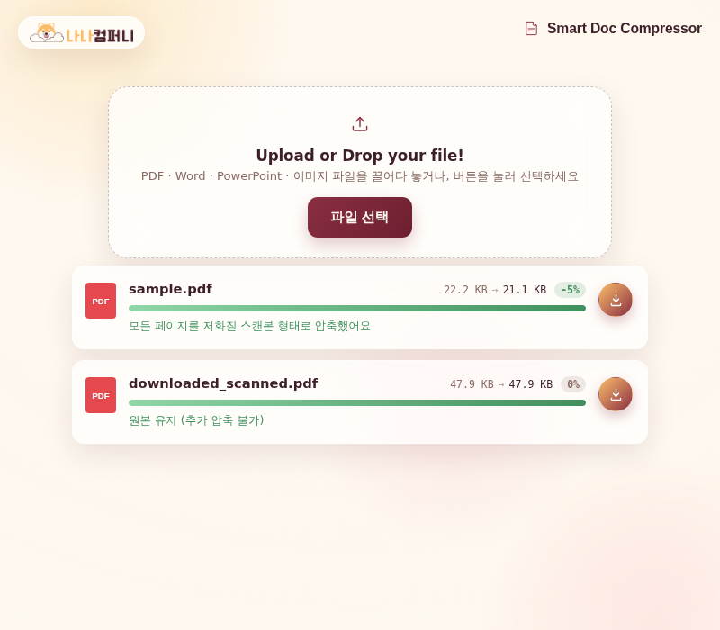

# 📦 Smart Doc Compressor (예제 6)

PDF, Word, PowerPoint, HWP, 이미지 파일을 업로드하면 자동으로 용량을 압축해주는 문서 용량 압축기예요. 여러 파일을 한 번에 올려서 각각 압축 전후 용량을 비교할 수 있어요.

## 실행 결과

두 개의 PDF 파일을 업로드한 결과 화면이에요. `sample.pdf`는 22.2KB → 21.1KB(-5%)로 압축되었고, 이미 최적화된 `downloaded_scanned.pdf`는 "원본 유지(추가 압축 불가)"로 안내돼요.

## 주요 기능

- PDF · Word(.doc/.docx) · PowerPoint(.ppt/.pptx) · HWP · 이미지(.jpg/.png/.webp) 업로드 지원
- 여러 파일을 한 번에 드래그 앤 드롭
- 파일별로 압축 전/후 용량과 절감률(%)을 실시간 표시
- 더 이상 압축할 수 없는 파일은 "원본 유지" 안내
- 압축 완료 후 파일별 다운로드

## 기술 스택

- Vanilla HTML/CSS/JavaScript
- pdf-lib, JSZip 등 필요한 라이브러리를 `vendor/` 폴더에 내장해 `file://` 환경에서도 동작

## 실행 방법

`index.html`을 더블클릭해서 브라우저로 열면 바로 사용할 수 있어요.
