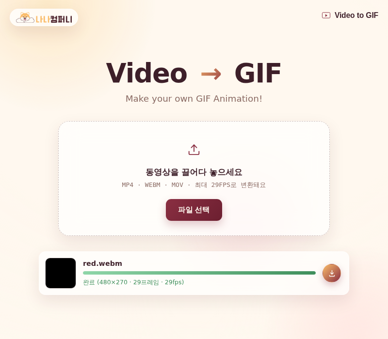

# 🎬 Video to GIF (예제 8)

동영상 파일을 업로드하면 자동으로 GIF 애니메이션으로 변환해주는 웹 앱이에요. MP4, WEBM, MOV 파일을 지원하고, 최대 29FPS로 변환돼요.

## 실행 결과

`red.webm` 동영상 파일을 업로드해서 480×270 크기, 29프레임, 29fps의 GIF로 변환을 완료한 화면이에요. 변환이 끝나면 다운로드 버튼이 활성화돼요.

## 주요 기능

- MP4 · WEBM · MOV 동영상 업로드 (드래그 앤 드롭 지원)
- 최대 29FPS로 GIF 애니메이션 자동 변환
- 변환 진행률을 프로그레스 바로 실시간 표시
- 변환 완료 후 GIF 다운로드
- 여러 동영상을 한 번에 올려 순차적으로 변환 가능

## 기술 스택

- Vanilla HTML/CSS/JavaScript
- `<video>` + `<canvas>`로 프레임을 추출하고 gif.js(`vendor/`)로 인코딩
- `file://` 환경에서도 Web Worker가 동작하도록 base64+Blob URL 방식으로 워커를 내장

## 실행 방법

`index.html`을 더블클릭해서 브라우저로 열면 바로 사용할 수 있어요.

> 참고: 브라우저가 재생 코덱을 지원하지 않는 동영상 파일은 "동영상을 열 수 없어요" 메시지가 표시될 수 있어요.

## 💬 소감

동영상 프레임을 뽑아 GIF로 변환하는 과정을 직접 구현하면서 처음 다뤄보는 인코딩 방식도 이해할 수 있었어요. **내가 직접 해봤으니 다음에 비슷한 미디어 변환 앱이 필요할 때도 충분히 만들 수 있어요.**
