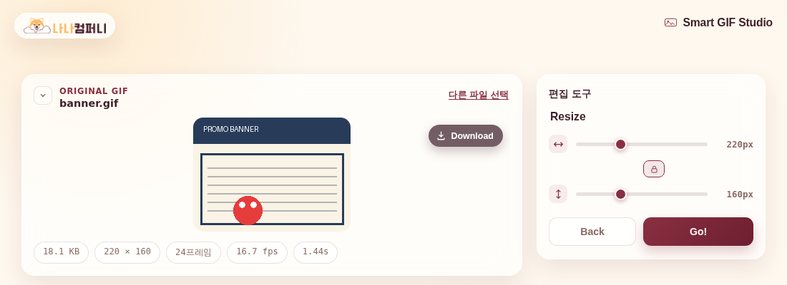

# 🎞️ GIF 편집 스튜디오 (예제 9)

브라우저 안에서 GIF 파일 하나로 리사이즈, 자르기, 회전, 배속 조절, 구간 자르기, 용량 최적화, 무손실 압축, 다른 포맷(JPG/MP4) 변환까지 한 번에 처리하는 올인원 GIF 편집 웹 앱이에요.

## 실행 결과

GIF를 업로드한 뒤 편집 도구 중 **Resize**를 선택한 화면이에요. 원본 GIF의 크기·용량·프레임 수·재생 시간이 카드로 표시되고, 오른쪽 패널에서 가로/세로 크기를 슬라이더로 조절할 수 있어요.

## 주요 기능

- **Resize**: 가로/세로 크기 조절 (비율 잠금 지원)
- **Crop**: 비율별 자르기 (Fill / Pad 모드, 커스텀 비율)
- **Rotate**: 90도 단위 회전
- **Cut**: 원하는 구간만 잘라내기
- **Speed**: 재생 속도 조절
- **Reverse**: 역재생 GIF 생성
- **Optimize**: 프레임 수·해상도·용량 기준 최적화
- **Lossless**: 무손실 압축
- **Convert**: JPG(대표 프레임) / MP4로 변환

## 기술 스택

- Vanilla HTML/CSS/JavaScript (프레임워크 없음)
- [gif.js](https://github.com/jnordberg/gif.js) 등 필요한 라이브러리를 `vendor/` 폴더에 내장
- `file://`로 더블클릭해서 바로 열어도 동작하도록, Web Worker를 base64로 인코딩해 Blob URL로 불러오는 방식 사용

## 실행 방법

`index.html` 파일을 더블클릭해서 브라우저로 열면 바로 사용할 수 있어요. 별도의 서버나 설치 과정이 필요 없어요.
