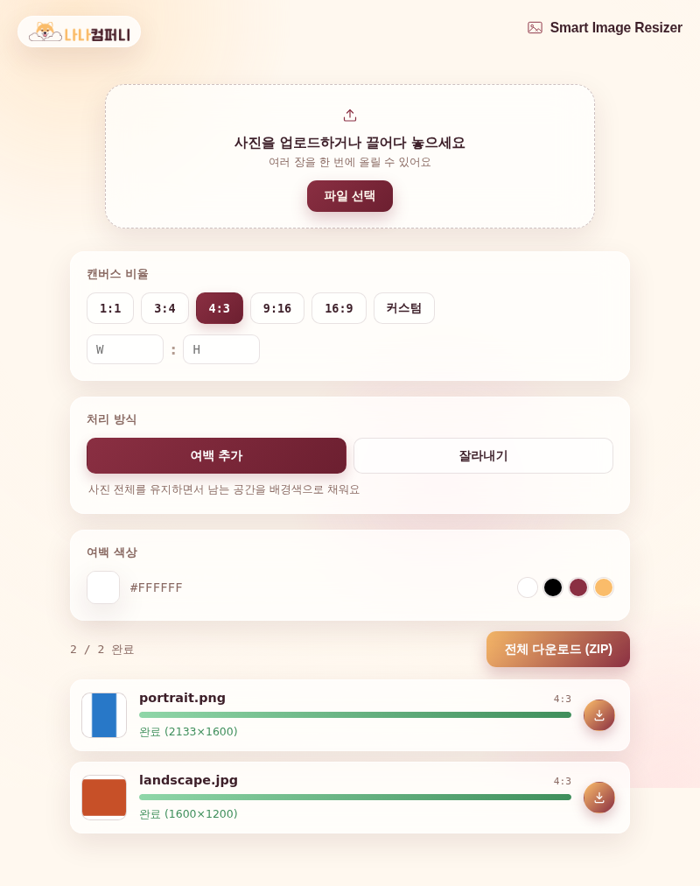

# 🖼️ Smart Image Resizer (예제 7)

여러 장의 사진을 한 번에 업로드해서 원하는 비율로 일괄 리사이즈해주는 웹 앱이에요. 여백을 추가하거나 잘라내는 방식을 고를 수 있고, 결과물을 ZIP으로 한꺼번에 내려받을 수 있어요.

## 실행 결과

가로·세로 사진 2장을 업로드하고 캔버스 비율을 4:3으로 설정한 결과 화면이에요. 두 사진 모두 4:3 비율로 처리가 완료되었고, "전체 다운로드(ZIP)" 버튼으로 한 번에 받을 수 있어요.

## 주요 기능

- 여러 장의 이미지를 한 번에 업로드
- 1:1, 3:4, 4:3, 9:16, 16:9 및 커스텀 비율 선택
- "여백 추가"(레터박스) / "잘라내기" 두 가지 처리 방식
- 여백 색상 직접 지정(색상 피커 + HEX 입력)
- 개별 다운로드 및 전체 ZIP 다운로드

## 기술 스택

- Vanilla HTML/CSS/JavaScript
- Canvas API를 이용한 이미지 리사이즈/크롭 처리
- JSZip(`vendor/jszip.min.js`)으로 일괄 ZIP 다운로드 구현

## 실행 방법

`index.html`을 더블클릭해서 브라우저로 열면 바로 사용할 수 있어요.
