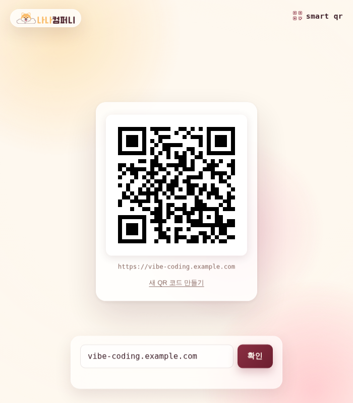

# 📱 Smart QR (예제 5)

URL을 입력하면 바로 QR 코드를 만들어주는 웹 앱이에요. 생성된 QR 코드는 클릭 한 번으로 JPG 이미지로 저장할 수 있어요.

## 실행 결과

`vibe-coding.example.com`을 입력하고 QR 코드를 생성한 결과 화면이에요. QR 코드 아래에 원본 URL이 표시되고, QR 코드를 클릭하면 JPG로 다운로드할 수 있어요.

## 주요 기능

- URL 입력 후 즉시 QR 코드 생성
- 잘못된 URL 형식은 에러 메시지로 안내
- 생성된 QR 코드를 클릭해서 JPG 이미지로 다운로드
- "새 QR 코드 만들기"로 다시 입력 가능

## 기술 스택

- Vanilla HTML/CSS/JavaScript
- QR 코드 생성 라이브러리(`vendor/qrcode.js`)를 로컬에 내장해서 `file://` 환경에서도 동작

## 실행 방법

`index.html`을 더블클릭해서 브라우저로 열면 바로 사용할 수 있어요.
