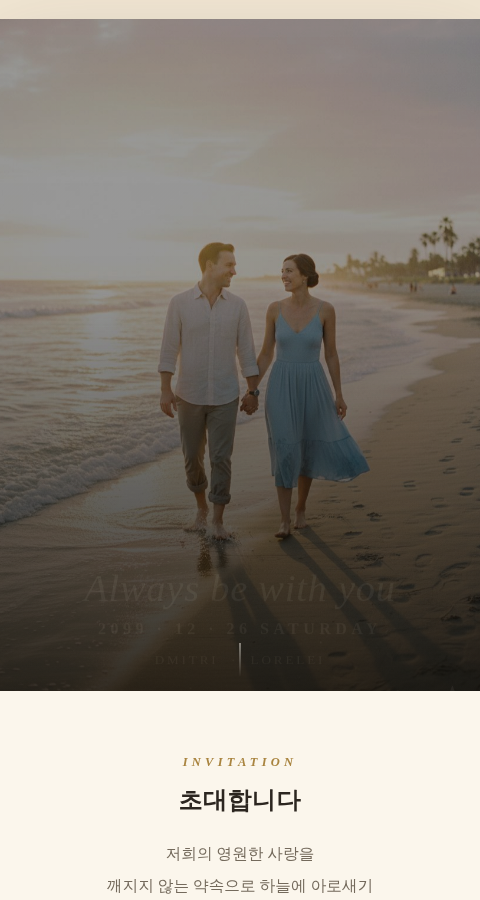

# 💌 모바일 청첩장 (예제 4)

돈 주고 만들 필요 없이 직접 만든 모바일 청첩장이에요. 스크롤을 내리면서 커플 사진, 인사말, 예식 일정, 카운트다운, 갤러리, 연락처, 마음 전하기(축의금) 안내까지 차례로 보여주는 감성적인 한 장짜리 페이지예요.

## 실행 결과

첫 화면(히어로 섹션)이에요. 배경 사진 위에 큰 타이포그래피로 문구와 예식 날짜, 신랑·신부 이름이 표시되고, 스크롤을 내리면 "초대합니다" 인사말 섹션으로 이어져요.

## 주요 기능

- 배경 사진 + 감성적인 세리프 폰트를 활용한 히어로 섹션
- 신랑·신부 소개 및 커플 사진 갤러리
- 예식 일정 안내 및 실시간 카운트다운
- 오시는 길 / 연락처 안내
- 마음 전하기(축의금 계좌) 안내 카드
- 라이트/다크 모드 모두 대응하는 색상 테마

## 기술 스택

- Vanilla HTML/CSS/JavaScript (프레임워크 없음, 단일 `index.html` 파일)
- Google Fonts (Cormorant Garamond, Gowun Batang)
- `prefers-color-scheme` 기반 다크 모드 대응

## 실행 방법

`index.html`을 더블클릭해서 브라우저로 열면 바로 볼 수 있어요.
