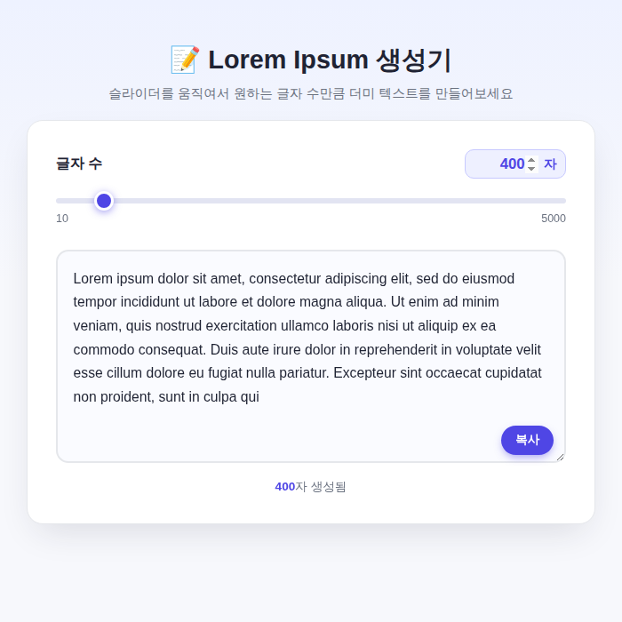

# 📝 Lorem Ipsum 생성기 (예제 26)

슬라이더를 움직이거나 숫자를 직접 입력해서 원하는 글자 수만큼 정확하게 Lorem Ipsum 더미 텍스트를 생성해주는 웹 앱이에요. 최소 10자부터 최대 5000자까지 지원해요.

## 실행 결과

글자 수를 400자로 설정했을 때, 정확히 400자 분량의 Lorem Ipsum 텍스트가 생성된 화면이에요.

## 주요 기능

- 슬라이더와 숫자 입력 필드가 서로 실시간으로 동기화
- 10자 ~ 5000자 범위에서 정확한 글자 수로 텍스트 생성
- 기본값은 150자 분량
- 원클릭 "복사" 버튼 (file:// 환경에서도 동작하도록 `execCommand("copy")` 사용)

## 기술 스택

- Vanilla HTML/CSS/JavaScript

## 실행 방법

`index.html`을 더블클릭해서 브라우저로 열면 바로 사용할 수 있어요.
