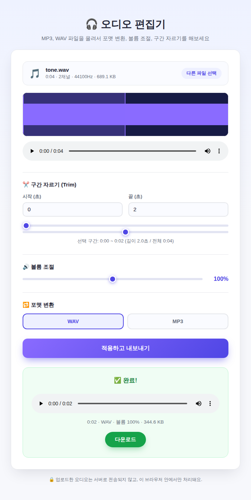

# 🎧 오디오 편집기 (예제 32)

MP3, WAV 등 오디오 파일을 업로드해서 포맷 변환, 볼륨 조절, 구간 자르기(Trim)를 할 수 있는 웹 앱이에요.

## 실행 결과

`tone.wav` 파일을 업로드하고 0~2초 구간으로 자른 뒤 WAV로 내보낸 결과 화면이에요. 파형과 선택 구간이 표시되고, 편집이 완료되면 결과 오디오를 바로 재생·다운로드할 수 있어요.

## 주요 기능

1. **포맷 변환**: WAV ↔ MP3 상호 변환
2. **볼륨 조절**: 0%~200% 범위로 음량 조절
3. **구간 자르기(Trim)**: 슬라이더 또는 숫자 입력으로 원하는 구간만 잘라내기
4. 파형(waveform) 시각화 및 선택 구간 표시
5. 업로드한 오디오는 서버로 전송되지 않고 브라우저 안에서만 처리

## 기술 스택

- Vanilla HTML/CSS/JavaScript
- Web Audio API (`AudioContext.decodeAudioData`) — 오디오 디코딩 및 샘플 단위 편집
- [lamejs](https://github.com/zhuker/lamejs) (`vendor/lame.min.js`) — MP3 인코딩
- 직접 구현한 44바이트 RIFF 헤더 WAV(PCM16) 인코더

## 실행 방법

`index.html`을 더블클릭해서 브라우저로 열면 바로 사용할 수 있어요.
