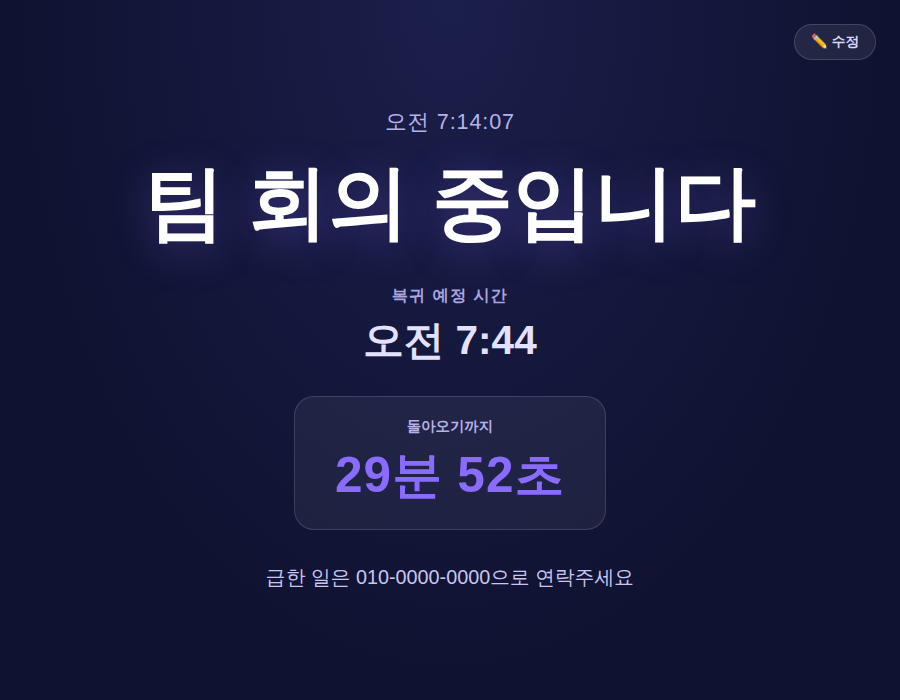

# 🔔 부재 중 알리미 (예제 28)

잠시 자리를 비웠을 때 화면에 띄워두는 안내 화면이에요. 지금 하고 있는 일정, 돌아오는 시간, 기타 안내 문구를 입력하면 큰 화면에 정보와 실시간 카운트다운을 보여줘요.

## 실행 결과

"팀 회의 중입니다"라는 일정과 복귀 예정 시간, 안내 문구를 입력한 뒤 표시된 화면이에요. 일정이 가장 큰 글씨로 강조되고, 복귀까지 남은 시간이 실시간으로 카운트다운돼요.

## 주요 기능

- 일정 / 복귀 예정 시간 / 기타 안내 문구 입력
- 일정은 화면에서 가장 크게 강조 표시
- 복귀 시간까지 남은 시간을 분·초 단위로 실시간 카운트다운
- 현재 시각도 함께 표시
- "수정" 버튼으로 설정 화면으로 돌아가 다시 입력 가능

## 기술 스택

- Vanilla HTML/CSS/JavaScript
- `clamp()`를 활용한 반응형 대형 타이포그래피

## 실행 방법

`index.html`을 더블클릭해서 브라우저로 열면 바로 사용할 수 있어요.

## 💬 소감

일정, 복귀 시간, 실시간 카운트다운까지 실제로 자리에 두고 쓸 수 있는 화면을 직접 만들어봤어요. **내가 직접 해봤으니 다음에 비슷한 안내·알림 화면이 필요할 때도 충분히 만들 수 있어요.**
