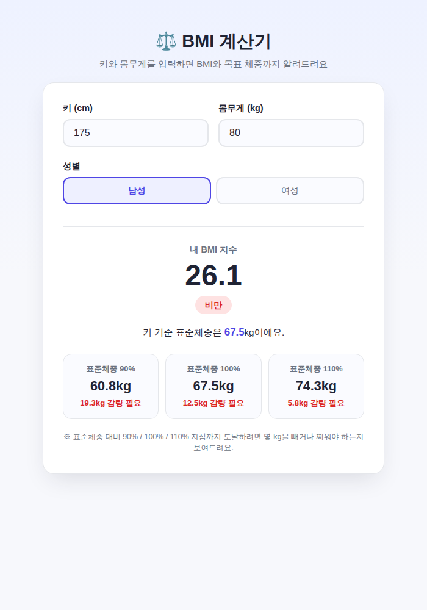

# ⚖️ Keep Fit! BMI 계산기 (예제 29)

키, 몸무게, 성별을 입력하면 BMI 지수를 계산하고, 표준체중을 기준으로 90% / 100% / 110% 지점까지 몇 kg을 빼거나 찌워야 하는지 알려주는 웹 앱이에요.

## 실행 결과

키 175cm, 몸무게 80kg, 남성을 입력한 결과 화면이에요. BMI 26.1(비만)로 판정되고, 표준체중(67.5kg) 기준 90%·100%·110% 지점까지 각각 감량해야 할 체중이 표시돼요.

## 주요 기능

- 키·몸무게·성별 입력 및 실시간 BMI 계산
- 저체중 / 정상 / 과체중 / 비만 / 고도비만 5단계 판정
- 성별에 따른 표준체중 계산 (남성: (키-100)×0.9, 여성: (키-100)×0.85)
- 표준체중 90% / 100% / 110% 기준 목표 체중과 증감량 안내

## 기술 스택

- Vanilla HTML/CSS/JavaScript

## 실행 방법

`index.html`을 더블클릭해서 브라우저로 열면 바로 사용할 수 있어요.
