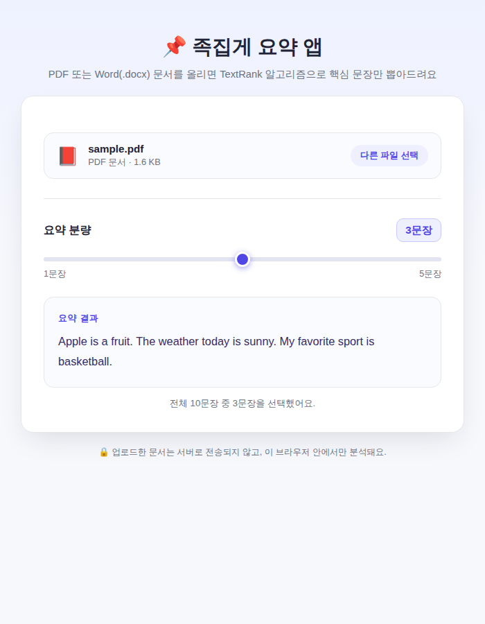

# 📌 문서의 요점만 찾아주는 족집게 요약 앱 (예제 31)

PDF나 Word(.docx) 문서를 업로드하면 TextRank 알고리즘으로 핵심 문장만 뽑아서 요약해주는 웹 앱이에요. 슬라이더로 1문장부터 5문장까지 원하는 요약 분량을 고를 수 있어요.

## 실행 결과

샘플 PDF(10문장짜리 영어 지문)를 업로드하고 요약 분량을 3문장으로 설정한 결과 화면이에요. TextRank가 가장 중요하다고 판단한 3개 문장이 원문 순서대로 추려져 나와요.

## 주요 기능

- PDF, DOCX 파일 업로드
- 슬라이더로 요약 문장 수(1~5문장) 조절
- TextRank 알고리즘 기반 핵심 문장 추출 (요약문은 원문 등장 순서를 유지)
- 업로드한 문서는 서버로 전송되지 않고 브라우저 안에서만 처리

## TextRank 요약 로직 (요약)

문장을 분리 → 각 문장을 단어 빈도 벡터로 변환 → 문장 간 코사인 유사도 행렬 생성 → 가중치 PageRank로 문장별 중요도 점수 계산 → 점수가 높은 상위 N개 문장을 원문 순서대로 재배열해서 출력하는 방식이에요.

## 기술 스택

- Vanilla HTML/CSS/JavaScript
- [pdf.js](https://mozilla.github.io/pdf.js/), [JSZip](https://stuk.github.io/jszip/) — PDF/DOCX 텍스트 추출 (`documents` 프로젝트와 동일한 파서 재사용)
- 직접 구현한 TextRank 모듈 (`textrank.js`)

## 실행 방법

`index.html`을 더블클릭해서 브라우저로 열면 바로 사용할 수 있어요.

## 💬 소감

TextRank 알고리즘으로 문서의 핵심 문장을 뽑아내는 요약 기능을 처음 구현해봤어요. **내가 직접 해봤으니 다음에 비슷한 텍스트 분석·요약 앱이 필요할 때도 충분히 만들 수 있어요.**
