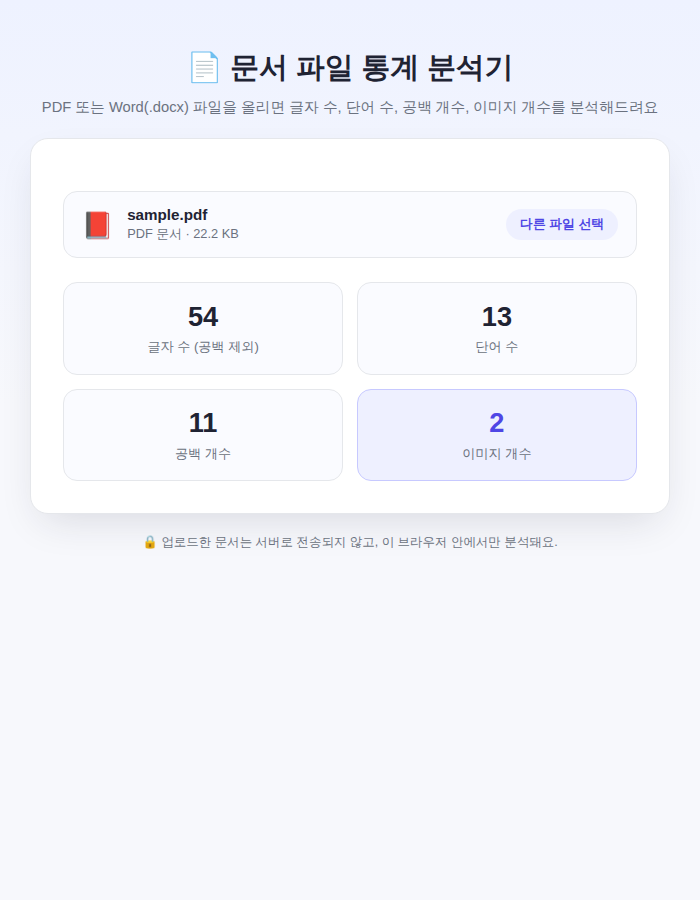

# 📄 문서 파일 통계 분석기 (예제 25)

PDF나 Word(.docx) 문서를 업로드하면 글자 수, 단어 수, 공백 개수, 포함된 이미지 개수를 분석해서 보여주는 웹 앱이에요.

## 실행 결과

샘플 PDF 문서를 업로드한 결과 화면이에요. 글자 수 54자, 단어 수 13개, 공백 11개, 이미지 2개가 각각 카드로 표시돼요.

## 주요 기능

- PDF, DOCX 파일 업로드 (드래그 앤 드롭 지원)
- 글자 수(공백 제외), 단어 수, 공백 개수, 이미지 개수 분석
- 업로드한 문서는 서버로 전송되지 않고 브라우저 안에서만 처리 (개인정보 보호)

## 기술 스택

- Vanilla HTML/CSS/JavaScript
- [pdf.js](https://mozilla.github.io/pdf.js/) (`vendor/pdf.min.js`) — PDF 텍스트/이미지 추출
- [JSZip](https://stuk.github.io/jszip/) (`vendor/jszip.min.js`) — DOCX(zip) 내부 XML 파싱
- `file://` 환경에서도 pdf.js의 Web Worker가 동작하도록 base64+Blob URL 방식으로 워커를 내장

## 실행 방법

`index.html`을 더블클릭해서 브라우저로 열면 바로 사용할 수 있어요.

## 💬 소감

PDF·DOCX 문서에서 글자 수, 단어 수, 이미지 개수까지 뽑아내는 파싱 로직을 직접 만들어봤어요. **내가 직접 해봤으니 다음에 비슷한 문서 분석 앱이 필요할 때도 충분히 만들 수 있어요.**
