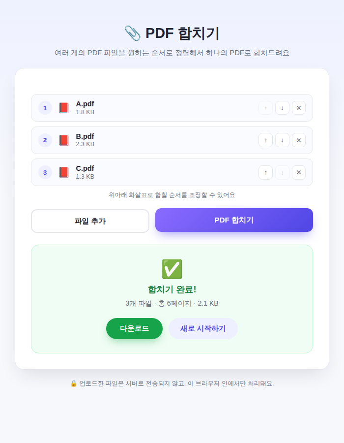

# 📎 PDF 합치기 (예제 27)

여러 개의 PDF 파일을 업로드해서 원하는 순서대로 정렬한 뒤, 하나의 PDF 문서로 합쳐주는 웹 앱이에요.

## 실행 결과

A.pdf, B.pdf, C.pdf 세 개의 파일을 업로드하고 합치기를 실행한 결과 화면이에요. 3개 파일, 총 6페이지짜리 PDF로 합쳐진 것을 확인할 수 있어요.

## 주요 기능

- 여러 PDF 파일을 한 번에 업로드
- 화살표 버튼으로 합칠 순서를 자유롭게 조정
- 불필요한 파일은 목록에서 제거 가능
- 합치기 완료 후 바로 다운로드
- 업로드한 파일은 서버로 전송되지 않고 브라우저 안에서만 처리

## 기술 스택

- Vanilla HTML/CSS/JavaScript
- [pdf-lib](https://pdf-lib.js.org/) (`vendor/pdf-lib.min.js`) — PDF 페이지 복사 및 병합

## 실행 방법

`index.html`을 더블클릭해서 브라우저로 열면 바로 사용할 수 있어요.
